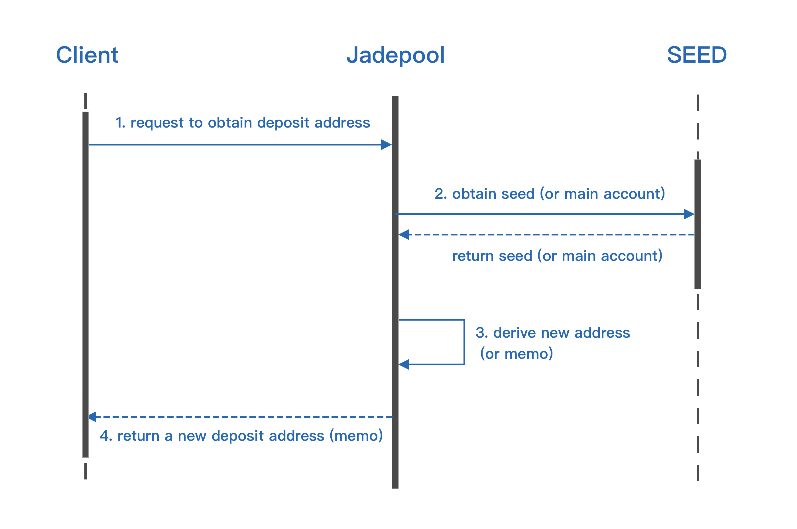

Deposit is one of the Jadepool Hub's main services。User needs to obtain a deposit address through the client system and transfers asset from his / her own wallet to the deposit address.

In order to support one blockchain, Jadepool must be configured with at least one node. With the node in sync with the chain, a scheduled task, whose interval settings can be customized, starts to scan all mined transactions in the new block and save any as “order” to database if the transaction should be accounted for. Considering the high possibility of temporary soft fork, every blockchain supported by Jadepool is configured with a “soft fork gap” setting in case Jadepool falsely saves transactions from invalid blocks, that means Jadepool only scans the block whose height is below the current block header minus the “soft fork gap”. Once the transaction is saved to database, Jadepool will keep track of it by querying transaction hash from node until it reaches the final state. No matter “done” or failed, Jadepool will make sure that the client system is informed. 

Please see [Deposit Address Mode](address-pattern.html) for more details of Jadepool Hub's deposit address.

 

Obtain Deposit Address Illustration:

 

Deposit Illustration:

